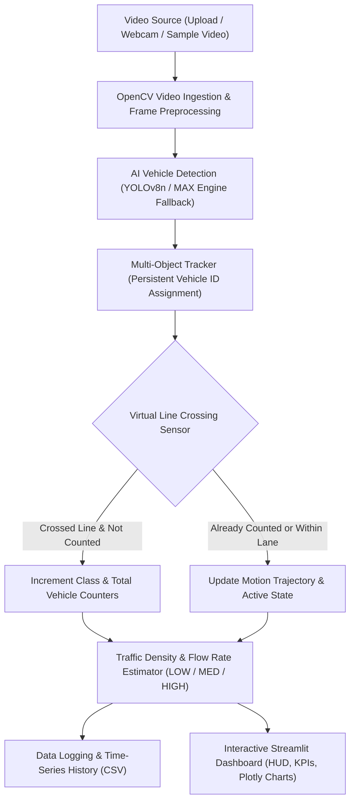

# 🚦 AI Traffic Monitoring & Analytics System

An end-to-end, real-time Computer Vision and AI traffic analytics platform designed as a complete college-level capstone project. The system ingests traffic video footage or live webcam streams, detects and tracks multiple vehicle classes using deep learning (YOLOv8 with MAX/Mojo acceleration fallback), counts unique vehicle crossings using a virtual tripwire sensor, classifies traffic congestion density, and visualizes real-time metrics through an interactive Streamlit dashboard.

---

## 🌟 Key Features

1. **Flexible Video Ingestion**:
   - Upload any custom traffic video (`.mp4`, `.avi`, `.mov`, `.mkv`).
   - Connect live webcam feeds for real-time edge processing.
   - Built-in sample video loader & realistic synthetic traffic video generator for instant demonstration without requiring external media files.

2. **Deep Learning Vehicle Detection**:
   - Detects five primary vehicle classes from the COCO dataset: **Car**, **Motorcycle**, **Bus**, **Truck**, and **Bicycle**.
   - Draws labeled bounding boxes with confidence scores and distinct class colors.
   - Configurable confidence threshold and IoU Non-Maximum Suppression (NMS) sliders.

3. **Multi-Object Tracking & Virtual Sensor Counting**:
   - Persistent track ID assignment using centroid Euclidean distance and motion vector matching.
   - Virtual tripwire trigger line positioned across the road.
   - Direction-aware crossing detection.
   - **Zero double-counting**: Uses a persistent set of counted track IDs to guarantee that every vehicle is counted strictly once.

4. **Dynamic Traffic Density Estimation**:
   - Classifies real-time congestion as **LOW**, **MEDIUM**, or **HIGH** based on active vehicle counts.
   - Configurable density thresholds adjustable in real-time from the sidebar.
   - Color-coded badges (Green, Orange, Red) in the HUD and dashboard cards.

5. **Live Analytics & Visualization**:
   - Real-time KPI summary cards (Total Vehicles, Cars, Motorcycles, Buses/Trucks, Density Status).
   - Real-time smoothed FPS counter.
   - Interactive Plotly time-series cumulative count line chart.
   - Vehicle classification distribution donut chart.
   - Real-time tabular logs updating dynamically.

6. **Automated Data Storage & Reporting**:
   - Periodically logs traffic snapshots to CSV: `Timestamp`, `Total_Vehicles`, `Cars`, `Motorcycles`, `Buses`, `Trucks`, `Bicycles`, `Active_Vehicles`, `Traffic_Density`, `Flow_Rate_VPM`.
   - Built-in **Download Analytics (CSV)** button for reporting and post-hoc traffic analysis.

7. **Modular MAX / Mojo AI Acceleration with Graceful Fallback**:
   - Includes an acceleration adapter (`utils/max_accelerator.py`) supporting Modular MAX Engine and Mojo where available.
   - Seamlessly falls back to native multi-threaded PyTorch (CPU/CUDA) or OpenCV on standard Windows environments.

---

## 🏗️ System Architecture



---

## 📁 Project Structure

```text
AI-Traffic-Monitoring/
│
├── app.py                      # Main Streamlit dashboard application
├── detector.py                 # YOLOv8 vehicle detection engine
├── tracker.py                  # Multi-object tracker & virtual line counter
├── analytics.py                # Traffic density, flow rate (VPM), and CSV exporter
├── config.py                   # Centralized configuration, class mappings, colors
├── requirements.txt            # Python dependencies
├── README.md                   # Project documentation and viva guide
│
├── models/                     # Model weights storage (yolov8n.pt)
├── videos/                     # Storage for sample & uploaded traffic videos
├── output/                     # Exported processed videos & snapshots
├── data/                       # CSV logs of traffic analytics sessions
└── utils/
    ├── __init__.py             # Package initializer
    ├── drawing_utils.py        # Bounding box, line, and HUD drawing overlays
    ├── video_utils.py          # Video capture, FPS counter, synthetic generator
    └── max_accelerator.py      # MAX / Mojo acceleration hook and PyTorch fallback
```

---

## 🔍 Detailed File Walkthrough

- **`app.py`**: The Streamlit user interface. Initializes session state, creates sidebar controls (sliders for confidence, line position, density cutoffs), displays KPI cards, renders the processed video stream with live HUD annotations, updates Plotly charts, and enables CSV report downloads.
- **`detector.py`**: Encapsulates YOLO vehicle detection. Loads model weights, applies runtime inference optimizations, filters raw detections to relevant vehicle classes (`car`, `motorcycle`, `bus`, `truck`, `bicycle`), and outputs structured bounding boxes with centroids.
- **`tracker.py`**: Contains `VehicleTracker` and `LineCounter`. `VehicleTracker` associates detections across frames using Euclidean distance and IoU matching to assign persistent track IDs. `LineCounter` evaluates centroid trajectories across the virtual tripwire, updating tallies while preventing double-counting via `counted_ids`.
- **`analytics.py`**: Manages traffic metrics. `TrafficDensityEstimator` categorizes congestion into `LOW`, `MEDIUM`, or `HIGH`. `TrafficAnalytics` records periodic snapshots, calculates vehicles per minute (VPM), and formats logs into Pandas DataFrames for CSV export.
- **`config.py`**: Single source of truth for paths, COCO vehicle class mappings, OpenCV BGR colors, hex color palettes, and default thresholds.
- **`utils/drawing_utils.py`**: Video rendering utilities. Draws colored bounding boxes with confidence tags, motion trails, the virtual counting line (which pulses green upon trigger), and a semi-transparent top banner HUD displaying real-time FPS and density.
- **`utils/video_utils.py`**: Handles video capture and properties. Features an automated sample traffic generator that creates an animated multi-lane highway simulation with moving vehicles, enabling offline testing.
- **`utils/max_accelerator.py`**: Checks for Modular MAX Engine / Mojo SDK. When absent, it configures PyTorch with multi-threaded CPU/GPU settings and reports engine status to the UI.

---

## ⚙️ Installation & Setup (Windows)

### Step 1: Open Terminal / PowerShell
Navigate to the project directory:
```powershell
cd c:\Users\rit\Desktop\ecrio
```

### Step 2: (Recommended) Create & Activate Virtual Environment
```powershell
python -m venv venv
.\venv\Scripts\Activate.ps1
```

### Step 3: Install Required Dependencies
```powershell
python -m pip install -r requirements.txt
```

---

## 🚀 Running the Application

Launch the Streamlit dashboard using:
```powershell
python -m streamlit run app.py
```

Streamlit will launch local browser access at:
```text
http://localhost:8501
```

### How to Use the Dashboard:
1. **Choose Video Source**: Select **Sample Traffic Video** (ready to run), **Upload Video File**, or **Live Webcam**.
2. **Tune Parameters**: Adjust the **Confidence Threshold**, **Virtual Line Position**, and **Density Cutoffs** from the sidebar.
3. **Start Monitoring**: Click **▶ Start Monitoring**. The live annotated feed will stream with vehicle bounding boxes and tripwire triggers.
4. **Monitor Analytics**: Observe vehicle counts, density badges, and dynamic Plotly charts in real time.
5. **Download Report**: Click **📥 Download Analytics (CSV)** at any time to export the recorded session data.

---

## 🎓 College Viva & Presentation Q&A

### Q1: Why use YOLOv8 instead of traditional Haar Cascades or HOG + SVM?
**Answer**: Traditional methods like Haar Cascades and HOG + SVM suffer from high false-positive rates, poor generalization under varying lighting conditions, and slow multi-scale sliding-window processing. YOLOv8 is a single-stage convolutional neural network that formulates detection as a single regression problem, detecting vehicles in one forward pass with high mean Average Precision (mAP) and real-time inference speeds (30+ FPS on CPU).

### Q2: How is vehicle double-counting prevented?
**Answer**: Double-counting is prevented using a two-tier mechanism:
1. **Multi-Object Tracking (MOT)**: Each detected vehicle is assigned a persistent unique identifier (`track_id`) based on spatial centroid distance across consecutive frames.
2. **State Set Membership**: When a vehicle's centroid crosses the virtual counting line coordinate, its `track_id` is registered in a persistent Python `set` (`counted_ids`). Future frames check `if track_id not in counted_ids` before triggering an increment, guaranteeing each vehicle is counted exactly once.

### Q3: How is Traffic Density calculated?
**Answer**: Traffic density is estimated from the instantaneous count of active vehicles currently present in the camera's region of interest (ROI). It is categorized into three levels based on configurable thresholds:
- $\text{Active Vehicles} \le \text{Threshold}_{\text{low}} \implies \textbf{LOW}$
- $\text{Threshold}_{\text{low}} < \text{Active Vehicles} \le \text{Threshold}_{\text{medium}} \implies \textbf{MEDIUM}$
- $\text{Active Vehicles} > \text{Threshold}_{\text{medium}} \implies \textbf{HIGH}$

### Q4: How does the MAX / Mojo acceleration fallback work?
**Answer**: Modular MAX Engine and Mojo represent modern AI compilation toolchains designed for low-latency inference on heterogeneous hardware. Because MAX Engine SDK is primarily distributed for Linux/WSL2 and macOS, the system implements an abstraction layer in `utils/max_accelerator.py` that checks for `max.engine`. If detected, it compiles the model graph using MAX; if not, it automatically and gracefully initializes multi-threaded PyTorch / OpenCV DNN with zero breaking changes or runtime errors.
